# 🔐 FlowGateX Test Credentials Guide

## Quick Start

Your FlowGateX application now has **hardcoded test credentials** ready for immediate testing. No backend or Firebase setup required!

## 🎯 Test Accounts

| Role               | Email                          | Password                | Access Level                    |
| ------------------ | ------------------------------ | ----------------------- | ------------------------------- |
| **👤 Attendee**    | `mekesh.officials@gmail.com`   | `Mekesh@attendee1236`   | Browse events, book tickets     |
| **📋 Organizer**   | `mekeshkumarm.23eee@kongu.edu` | `Mekesh@organizer1236`  | Create/manage events, analytics |
| **🛡️ Admin**       | `mekeshkumar1236@gmail.com`    | `Mekesh@admin1236`      | System administration           |
| **👑 Super Admin** | `mekesh.engineer@gmail.com`    | `Mekesh@superadmin1236` | Complete system control         |

## 🚀 How to Use

1. **Start your development server:**

   ```bash
   npm run dev
   ```

2. **Navigate to login page:**

   ```
   http://localhost:3000/login
   ```

3. **Enter credentials:**
   - Choose any email from the table above
   - Enter the corresponding password
   - Click "Sign in"

4. **Automatic redirect:**
   - You'll be redirected to your role-specific dashboard
   - Confetti animation on successful login! 🎉

## 🔧 Implementation Details

### Files Modified

1. **`src/lib/constants.ts`**
   - Added `SUPER_ADMIN` to `UserRole` enum

   ```typescript
   export enum UserRole {
     USER = 'user',
     ORGANIZER = 'organizer',
     ADMIN = 'admin',
     SUPER_ADMIN = 'superadmin', // ✨ NEW
   }
   ```

2. **`src/lib/mockAuth.ts`**
   - Added hardcoded test credentials with passwords
   - Implemented password validation
   - Passwords are NOT stored in localStorage for security

3. **`.env.local`**
   - `VITE_MOCK_MODE=true` (already enabled)
   - Ensures mock authentication is active

### Authentication Flow

```mermaid
graph TD
    A[User enters credentials] --> B{Check VITE_MOCK_MODE}
    B -->|true| C[Use mockAuth.ts]
    B -->|false| D[Use Firebase]
    C --> E{Email exists in MOCK_USERS?}
    E -->|No| F[Show error: Invalid email]
    E -->|Yes| G{Password matches?}
    G -->|No| H[Show error: Invalid password]
    G -->|Yes| I[Store user in localStorage]
    I --> J[Fire confetti 🎉]
    J --> K[Redirect to dashboard]
```



## 🔍 Testing Scenarios

### Scenario 1: Attendee Login

```
Email: mekesh.officials@gmail.com
Password: Mekesh@attendee1236
Expected: Redirect to /dashboard (User dashboard)
```

### Scenario 2: Organizer Login

```
Email: mekeshkumarm.23eee@kongu.edu
Password: Mekesh@organizer1236
Expected: Redirect to /organizer (Organizer dashboard)
```

### Scenario 3: Admin Login

```
Email: mekeshkumar1236@gmail.com
Password: Mekesh@admin1236
Expected: Redirect to /admin (Admin dashboard)
```

### Scenario 4: Super Admin Login

```
Email: mekesh.engineer@gmail.com
Password: Mekesh@superadmin1236
Expected: Redirect to /admin (Super Admin dashboard)
```

### Scenario 5: Invalid Credentials

```
Email: wrong@email.com
Password: wrongpassword
Expected: Error message "Invalid email or password"
```

## 🎨 Login Page Features

- ✅ Email validation (regex pattern)
- ✅ Password validation (minimum 6 characters)
- ✅ Show/hide password toggle
- ✅ Remember me checkbox
- ✅ Real-time error messages
- ✅ Loading states with animations
- ✅ Confetti celebration on success
- ✅ Theme switcher (light/dark mode)
- ✅ Responsive design
- ✅ Accessibility features (ARIA labels)

## 🔒 Security Features

1. **Password Validation**
   - Passwords are validated against stored values
   - Wrong password = Error message

2. **Password Storage**
   - Passwords are NOT stored in localStorage
   - Only user profile data is persisted
   - Passwords removed from user object after auth

3. **Session Management**
   - User session stored with key: `flowgatex_mock_user`
   - Cleared on logout
   - Persists across page refreshes

## 🛠️ Developer Tools

### Check Current User in Console

```javascript
// Get current logged-in user
const user = JSON.parse(localStorage.getItem('flowgatex_mock_user'));
console.log('Current user:', user);
```

### Clear Session

```javascript
// Force logout
localStorage.removeItem('flowgatex_mock_user');
window.location.reload();
```

### Check Mock Mode Status

```javascript
// Verify mock mode is enabled
console.log('Mock mode:', import.meta.env.VITE_MOCK_MODE);
```

## 📊 Role-Based Access Control

| Feature         | Attendee | Organizer | Admin | Super Admin |
| --------------- | -------- | --------- | ----- | ----------- |
| Browse Events   | ✅       | ✅        | ✅    | ✅          |
| Book Tickets    | ✅       | ✅        | ✅    | ✅          |
| Create Events   | ❌       | ✅        | ✅    | ✅          |
| Event Analytics | ❌       | ✅        | ✅    | ✅          |
| User Management | ❌       | ❌        | ✅    | ✅          |
| System Settings | ❌       | ❌        | ✅    | ✅          |
| Full Control    | ❌       | ❌        | ❌    | ✅          |

## 🐛 Troubleshooting

### Issue: Login doesn't work

**Solution:**

1. Check `.env.local` has `VITE_MOCK_MODE=true`
2. Restart dev server: `npm run dev`
3. Clear browser cache and localStorage

### Issue: Wrong dashboard shown

**Solution:**

1. Check user role in localStorage
2. Verify role routing in `src/routes/`

### Issue: Password validation fails

**Solution:**

1. Copy password exactly (case-sensitive)
2. No extra spaces before/after
3. Check keyboard language/layout

## 🔄 Switching to Firebase

When ready to use Firebase:

1. **Update `.env.local`:**

   ```env
   VITE_MOCK_MODE=false
   VITE_FIREBASE_API_KEY=your_real_key
   # ... other Firebase credentials
   ```

2. **Restart server:**

   ```bash
   npm run dev
   ```

3. **Test credentials will still work** for backward compatibility

## 📝 Legacy Demo Accounts

These accounts still work for backward compatibility:

| Email                     | Password  | Role      |
| ------------------------- | --------- | --------- |
| `demo@flowgatex.com`      | `demo123` | User      |
| `organizer@flowgatex.com` | `demo123` | Organizer |
| `admin@flowgatex.com`     | `demo123` | Admin     |

## ⚠️ Important Notes

- These credentials are **ONLY for development**
- **DO NOT** use in production
- **DO NOT** commit `.env.local` to Git
- Replace with proper authentication before deployment

## 🎉 You're All Set!

Your login page is now fully functional with test credentials. Start testing different user roles and explore the FlowGateX platform!

---

**Last Updated:** February 7, 2026  
**Version:** 1.0.0
