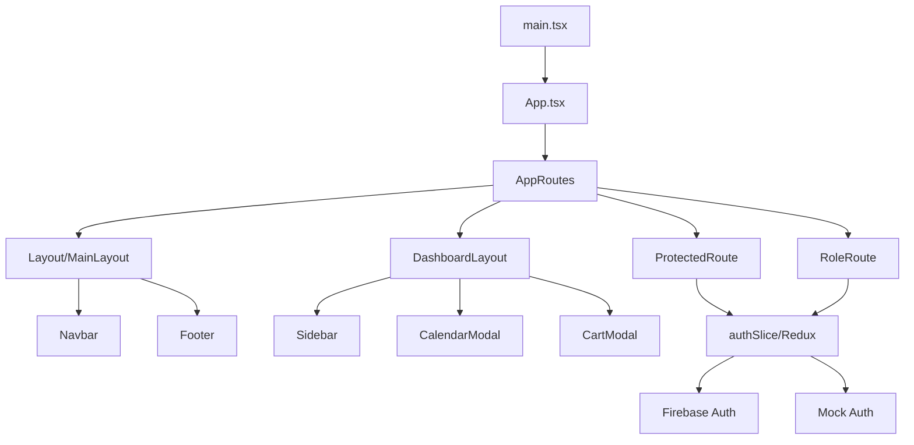

# FlowGateX Codebase Analysis Report

**Generated:** February 9, 2026  
**Project:** FlowGateX - Enterprise-Grade Event Management Platform  
**Framework:** React 18 + TypeScript + Vite

---

## Executive Summary

FlowGateX is a comprehensive event management platform built with modern web technologies. The codebase demonstrates **strong architectural foundations** with feature-based organization, role-based access control, and proper separation of concerns. However, several areas require attention for improved maintainability and performance.

---

## 1. Project Architecture

### 1.1 Technology Stack

| Category | Technologies |
|----------|-------------|
| **Core** | React 18.3, TypeScript 5.7, Vite 6.0 |
| **UI** | MUI 7.3, TailwindCSS 3.4, Framer Motion 11 |
| **State** | Redux Toolkit 2.5, Zustand 5.0, React Query 5.6 |
| **Backend** | Firebase 11 (Auth, Firestore, Storage) |
| **Forms** | React Hook Form 7.54, Zod 3.24 |
| **Charts** | Recharts 2.15, Chart.js 4.5 |

### 1.2 Folder Structure

```
src/
├── App.tsx                 # Root component
├── main.tsx               # Entry point with providers
├── components/            # Reusable UI components (28 items)
│   ├── common/           # Shared components (8 items)
│   ├── forms/            # Form components (4 items)
│   └── layout/           # Layout components (16 items)
├── features/              # Feature modules (64 items)
│   ├── analytics/        # Dashboard analytics
│   ├── auth/             # Authentication (27 items)
│   ├── booking/          # Ticket booking
│   ├── events/           # Event management (13 items)
│   ├── iot/              # IoT device integration
│   └── payment/          # Payment processing
├── hooks/                 # Custom React hooks (5 items)
├── lib/                   # Core utilities (8 items)
├── pages/                 # Route pages (20 items)
├── routes/                # Routing configuration (4 items)
├── store/                 # State management (4 items)
├── styles/                # CSS modules (28 items)
└── types/                 # TypeScript definitions (4 items)
```

---

## 2. Strengths

### ✅ Feature-Based Architecture
Each feature module follows a consistent structure:
```
feature/
├── components/    # UI components
├── hooks/         # Feature-specific hooks
├── services/      # API/business logic
└── types/         # TypeScript interfaces
```

### ✅ Role-Based Access Control
Well-implemented 4-tier access system:
- **User** - Basic attendee access
- **Organizer** - Event creation & management
- **Admin** - System administration
- **Super Admin** - Full platform control

### ✅ Build Optimization
Excellent Vite configuration with:
- **7 vendor chunks** for code splitting (React, MUI, Firebase, State, Charts, Forms, Utils)
- **Terser minification** with console removal
- **PWA support** with service worker caching
- **CSP headers** configured for security

### ✅ Developer Experience
- Path aliases (`@/components`, `@/features`, etc.)
- Strict TypeScript configuration
- ESLint + Prettier integration
- Mock mode for frontend-only development

### ✅ API Layer
Robust axios configuration with:
- Automatic auth token injection
- Token refresh on 401
- Rate limit handling
- Proper error code mapping

---

## 3. Weaknesses & Issues

### ⚠️ Large Component Files

| File | Lines | Size | Issue |
|------|-------|------|-------|
| `Navbar.tsx` | 1,204 | 51KB | **Critical** - Should be split |
| `DashboardLayout.tsx` | ~900 | 38KB | High complexity |
| `HomePage.tsx` | ~2,500 | 110KB | Needs componentization |
| `AboutPage.tsx` | ~1,200 | 56KB | Large monolithic file |
| `ContactPage.tsx` | ~1,000 | 43KB | Large monolithic file |

**Recommendation:** Extract sub-components, use composition patterns.

### ⚠️ Duplicate Type Definitions

`User` interface defined in both:
- `src/types/index.ts`
- `src/store/redux/slices/authSlice.ts`

**Recommendation:** Consolidate to single source of truth.

### ⚠️ Mixed State Management

Three state management solutions in use:
1. **Redux** - Auth state
2. **Zustand** - (Minimal usage)
3. **React Query** - Server state

**Recommendation:** Document clear guidelines for when to use each.

### ⚠️ CSS Architecture
- 28 style files totaling ~100KB
- Mix of CSS modules and global styles
- TailwindCSS + custom CSS coexisting

**Recommendation:** Standardize approach, consider CSS-in-JS for component isolation.

### ⚠️ Missing Test Infrastructure
```json
"test": "echo \"No tests configured yet\" && exit 0"
```
**Recommendation:** Add Jest/Vitest with React Testing Library.

---

## 4. Module Dependencies



### Key Dependency Chains:
1. **Auth Flow:** `main.tsx` → `Redux Provider` → `authSlice` → `Firebase/MockAuth`
2. **Routing:** `AppRoutes` → `ProtectedRoute/RoleRoute` → Role-based pages
3. **Data:** `React Query` → `api.ts` → `Firebase/External API`

---

## 5. Performance Analysis

### Build Configuration
| Metric | Value | Status |
|--------|-------|--------|
| Chunk Size Warning | 1000KB | ✅ Configured |
| Source Maps | Disabled (prod) | ✅ Good |
| Tree Shaking | Enabled | ✅ Good |
| Code Splitting | 7 chunks | ✅ Excellent |

### Runtime Considerations

| Area | Implementation | Impact |
|------|----------------|--------|
| Lazy Loading | Routes use `React.lazy()` | ✅ Positive |
| Query Caching | 5min stale, 10min gc | ✅ Good defaults |
| Debounced Hooks | Available | ✅ Ready for use |
| Media Queries | Hook-based | ✅ Efficient |

### Potential Bottlenecks
1. **Large bundle sizes** for public pages (HomePage ~110KB)
2. **Navbar** renders complex mega-menu on every page
3. **No image optimization** strategy visible

---

## 6. Scalability Assessment

### ✅ Scales Well
- Feature-based architecture supports team scaling
- Role system extensible for new user types
- API layer supports rate limiting and retries
- Firebase scales automatically

### ⚠️ Scaling Concerns
| Area | Current State | Improvement |
|------|---------------|-------------|
| Component Size | Monolithic public pages | Extract to component library |
| State Shape | Flat auth state | Consider normalized entities |
| Styles | Mixed approaches | Adopt single methodology |
| Testing | None | Add unit/integration tests |

---

## 7. Recommendations

### Priority 1: Critical (Immediate)
1. **Refactor `Navbar.tsx`** - Split into:
   - `NavbarLogo.tsx`
   - `NavbarLinks.tsx`
   - `MegaMenu.tsx`
   - `SearchModal.tsx` (already exists as sub-component)
   - `NotificationsDropdown.tsx` (already exists)
   - `UserMenu.tsx`

2. **Componentize Public Pages** - Extract reusable sections from HomePage, AboutPage, ContactPage

### Priority 2: High (This Sprint)
3. **Consolidate Types** - Single `User` interface exported from `types/index.ts`
4. **Add Testing** - Set up Vitest with initial coverage targets
5. **Document State Guidelines** - When to use Redux vs Zustand vs React Query

### Priority 3: Medium (Next Sprint)
6. **Image Optimization** - Add lazy loading, WebP support, CDN integration
7. **CSS Audit** - Remove unused styles, standardize approach
8. **Performance Monitoring** - Add Web Vitals tracking

### Priority 4: Low (Backlog)
9. **Storybook** - Component documentation
10. **E2E Tests** - Playwright/Cypress for critical flows
11. **Bundle Analysis** - Regular audits with `vite-bundle-visualizer`

---

## 8. File Statistics

| Category | Count | Total Size |
|----------|-------|------------|
| TypeScript/TSX | ~150 | ~800KB |
| CSS | 28 | ~100KB |
| Configuration | 15 | ~30KB |
| **Total src/** | 170 items | ~930KB |

### Largest Files
| File | Size | Location |
|------|------|----------|
| HomePage.tsx | 110KB | pages/public |
| AboutPage.tsx | 56KB | pages/public |
| Navbar.tsx | 51KB | components/layout |
| ContactPage.tsx | 43KB | pages/public |
| DashboardLayout.tsx | 38KB | components/layout/dashboard |

---

## 9. Security Considerations

### ✅ Implemented
- CSP headers in Vite config
- Firebase security rules (`firestore.rules`, `storage.rules`)
- Protected routes with role verification
- Auth token refresh mechanism

### ⚠️ Review Needed
- Verify Firebase rules cover all collections
- Test credential files (TEST_CREDENTIALS.md) should not be in production
- Ensure `.env.local` is in `.gitignore`

---

## 10. Conclusion

FlowGateX demonstrates **solid architectural foundations** suitable for an enterprise event management platform. The feature-based structure and role-based access control are well-implemented.

**Key Focus Areas:**
1. Reduce component size through better composition
2. Establish testing culture
3. Standardize styling approach
4. Document state management patterns

The codebase is in a **healthy state** for continued development with the recommended improvements.

---

*Report generated by Codebase Analyzer*
